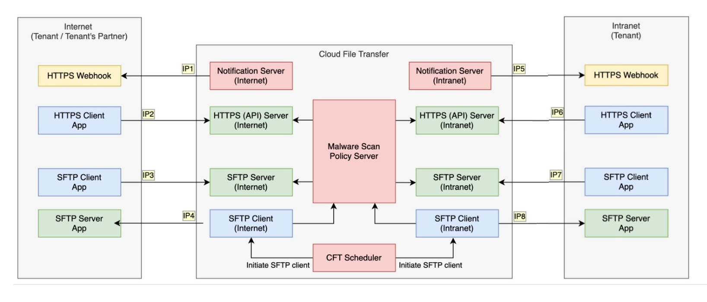

# Firewall Clearance Requirements

| HTTPS | |
|---|---|
| **INTERNET** | **INTRANET** |
| **Webhook (IP1):** 18.143.30.35:443 | **Webhook (IP5):** 10.211.0.128/28:443 10.211.0.144/28:443 10.211.0.160/28:443 10.211.0.176/28:443 |
| **Internet endpoints (IP2):** 13.215.24.12:443 13.251.95.103:443 54.179.172.253:443 | **Intranet endpoints (IP6):** 10.211.0.128/28:443 10.211.0.144/28:443 |

| SFTP | |
|---|---|
| **INTERNET** | **INTRANET** |
| **CFT SFTP Server endpoints (IP3):** 18.143.254.126:22 54.255.69.2:22 13.214.73.225:22 | **CFT SFTP Server endpoints (IP7):** 10.211.0.128/26:22 |
| **CFT SFTP Client endpoints (IP4):** 54.255.110.113 | **CFT SFTP Client endpoints (IP8):** 10.211.0.128/28:22 10.211.0.144/28:22 10.211.0.160/28:22 10.211.0.176/28:22 |

