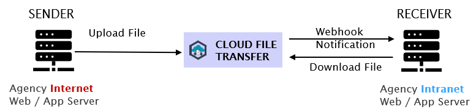

# Frequently Asked Questions

## Business Users

### About CFT

**1. What is Cloud File Transfer (CFT)?**

A centralized, fully managed file transfer service for the whole of government (WOG). CFT is designed to help you send and receive large files securely across zones. The sender and receiver can be an application or an end-user. Use CFT to transfer files between your intranet and internet zones or exchange files with your business partners and vendors as well as other agencies. 

CFT is a part of the SG Tech Stack (SGTS) and is hosted on the Government Commercial Cloud (GCC).

**Key Features:**

**Compliant file transfers**

CFT complies with Instruction Manual (IM8) Application Infrastructure Architecture Standard (AIAS) policy guidelines.

**Malware scanning and Content Disarm and Reconstruct (CDR)** 

Files are scanned for malware during transfer and malicious content is removed by the CDR functionality. Latest AV updates will be automatically applied to your files when they are being scanned.

**Large file transfers**

Up to 1GB per transaction.

**Application Programming Interface (API) access for web and mobile applications** 

Your applications can communicate with CFT through its APIs enabling you to access CFT to send, scan and receive files.

**Event-driven** 

Get notified when files are available for download either by setting up a webhook or registering your email for updates.

**Audit logs** 

View logs for file transfer activity with centralized auditing and reporting.

**CFT will be available as:**

- CFT for Backend Systems
- CFT for Web and Mobile Applications

**2. What are the benefits of using CFT?**

**Simple and automated file transfers -**
Experience time and cost savings. Just log in and transfer files within minutes without the operational cost and overheads of building and maintaining a similar service.

**Data integrity and security -**
CFT's file encryption feature ensures your files are safe at all times - at rest and during transfer - and arrive intact from sender to receiver.

**Scalable Software-as-a-Service (SaaS) -**
Increase or decrease the quantum of file transfers as per your requirement; CFT scales automatically in a highly secure manner.

**User-defined policies and file transfer workflows -**
Use policy templates to customize your file transfers.

**Self-service Admin Portal -**
CFT's intuitive admin portal allows you to:

- View performance metrics in an interactive dashboard
- Administer and manage file transfers 
- Manage your projects and users 
- Approve user requests

**3. Who are the end users?**

CFT has been designed for government agencies, their business partners, and vendors.

**4. How does I use it?**

Consider an example scenario:

Agency A wants to transfer a file from the internet to its intranet.

|**AS A SENDER**                                         |**AS A RECEIVER**
|---------------------------                             |--------------------
|Step 1: Agency A will authenticate itself to CFT system |Step 1: Agency A will receive a notification that the file is available for download
|Step 2: Upload file                                     |Step 2: Agency A will authenticate itself to CFT system
|                                                        |Step 3: Download file

<Fig 1 CFT for Backend Systems>

**5. What happens if the file contains malware?**

The file will not be transferred and CFT will notify the sender.

**6. What are the requirements to use CFT?**

- Sender system to send files over HTTPS
- Sender system to support PGP file encryption - Public key exchange
- Receiver system requires endpoint for webhook event

**7. What type of encryption standards are supported?**

Files in CFT are encrypted in transit and at rest with industry-standard schemes like HTTPS and AWS's S3-SSE-KMS.

Support for additional encryption schemes is on the roadmap.

**8. When will it be available?**

CFT for Backend Systems will be Generally Available in (October) 2021.

### Subscription

**1. I am interested in trying out CFT service, do you offer a trial?**

We offer a sandbox environment for you to try out our APIs and get a feel of the file transfer process.

Please follow the steps below to sign up:

1. Fill up the [onboarding form.](https://form.gov.sg/#!/60a4cca76179d60012cdacac/preview)
2. We will send you an email with the sandbox credentials.
3. Start testing with [OpenAPI specifications](https://docs.developer.gov.sg/docs/cft-rest-api-documentation/) or call the APIs from applications.

**2. If I am interested to subscribe, what are the next steps?**

[Sign up for a CFT production](https://form.gov.sg/#!/603cff5e399059001248f7d4/preview) to start transferring files on your live applications.

### Data Classification

**1. How is data hosted considering we have sensitive information?**

CFT is hosted in GCC (Restricted) and can transfer data with classifications up to Restricted.

We take care of compliance matters like AIAS so that you can focus on building your applications, systems, and APIs.

### Project Information

**1. How can I access CFT admin portal?**

Use your TechPass credentials to log in to the CFT admin portal.

**2. Need more help?**

Send us an email at [enquiries_CFT@tech.gov.sg][enquiries_CFT@tech.gov.sg].

### Integration

**1. How do I integrate CFT with my application?**

You can learn more about the v1 API and try it for yourself here: [CFT REST API documentation][https://docs.developer.gov.sg/docs/cft-rest-api-documentation/]

We have a sample project in the works (coming soon), watch this space!

## Customer Support

### Onboarding Issues

**1. I can't access CFT admin portal**

You need to be a TechPass user to log in to CFT admin portal.

If you do not have a TechPass account, click [here.][https://portal.stg.techpass.suite.gov.sg/public/home]

**2. My system has connectivity issues to CFT services**

Have you submitted the Firewall openings? <Insert FW rules template here>

Check your agency Firewall logs and CDNs (if any) for any blockage.

### Login Issues

**1. I am unable to login to CFT admin portal?**

A TechPass account is required to access CFT admin portal.

If you do not have a TechPass account, click [here.][https://portal.stg.techpass.suite.gov.sg/public/home]

If you are a TechPass user, your account may have been disabled due to inactivity. You will need to enable it.

**2. My TechPass account is disabled? How do I enable it?**

Your Agency Manager will need to raise a Service Request in the [TechPass portal][https://portal.stg.techpass.suite.gov.sg/public/home] to enable your account.

**3. How do I reset my TechPass password?**

You can reset password in the [TechPass portal][https://portal.stg.techpass.suite.gov.sg/public/home] to enable your account.

### Account Management Issues

**1. I am unable to add/remove users in my project**

You will need to have the Agency Manager role to add or remove users. Also, your users will need to have a TechPass account.

**2. I can't amend the user roles in my project**

You will need to have the Agency Manager role to amend user roles. Also, your users will need to have a TechPass account.

### File Transfer Issues

**1. I am not able to send files**

Here are a couple of troubleshooting steps:

Check if workflow status is active on the portal.

If you need any assistance, please take note of the x-cft-trace-id request header and send us an email at [enquiries_CFT@tech.gov.sg][enquiries_CFT@tech.gov.sg]

**2. I am not able to receive files**

Here are a couple of troubleshooting steps:

Check if workflow status is active on the portal.

If you need any assistance, please take note of the x-cft-trace-id request header and send us an email at [enquiries_CFT@tech.gov.sg][enquiries_CFT@tech.gov.sg]

**3. Will I receive any notifications if my files fail to transfer?**

WIP

