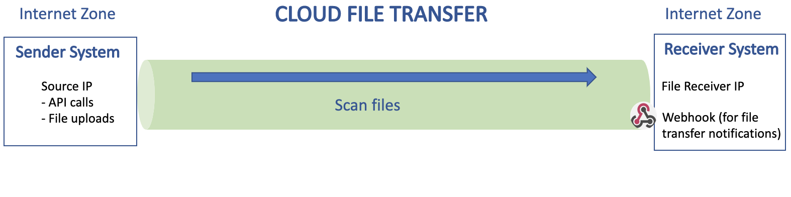

# Try out CFT Sandbox

## The Sandbox Environment
> **Cloud File Transfer (CFT) sandbox environment is a secure environment to try out CFT APIs**.
>
> Supports file transfers in **internet zone** between systems.
---
## Requirements
* Provide Webhook URL, if file transfer notification is required.

---

---
## How to sign up for CFT sandbox access

Onboarding to CFT sandbox is a simple process.
1. Fill up the [onboarding form.](https://form.gov.sg/#!/60a4cca76179d60012cdacac/preview)
2. Once request is processed, receive the API key by email.
3. Start testing with [OpenAPI specifications](https://docs.developer.gov.sg/docs/cft-rest-api-documentation/) or call the APIs from applications.

---
## Support
Support is delivered over telegram channel and during office hours.
