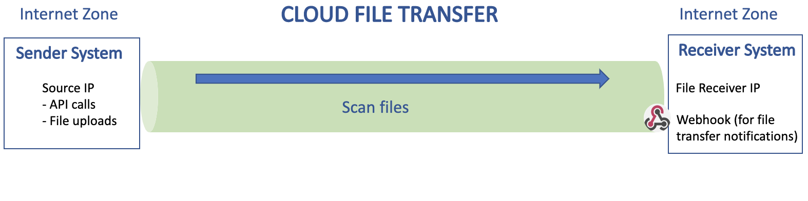

# Try out CFT Sandbox

## The Sandbox Environment
Cloud File Transfer (CFT) sandbox is a test environment that is almost identical to our production environment except that it supports only internet to internet transfers. It offers you a space to run file transfers with dummy files, test the API fully, and get a feel of the file transfer process before applying for a production account.

## How to access CFT sandbox

Onboarding to CFT sandbox is a simple process.
1. Fill up the [onboarding form.](https://form.gov.sg/#!/60a4cca76179d60012cdacac/preview)
2. Once we receive the request, we will email the sandbox credentials to the email address provided in the form.
3. Refer the [CFTv1.1-quick-start-guide](getting-started/CFTv1.1-sandbox-quick-start-guide.md) to learn how to use our APIs to send and receive files.
3. You can also refer the [OpenAPI specifications](https://docs.developer.gov.sg/docs/cft-rest-api-documentation/) or call the APIs from applications.

