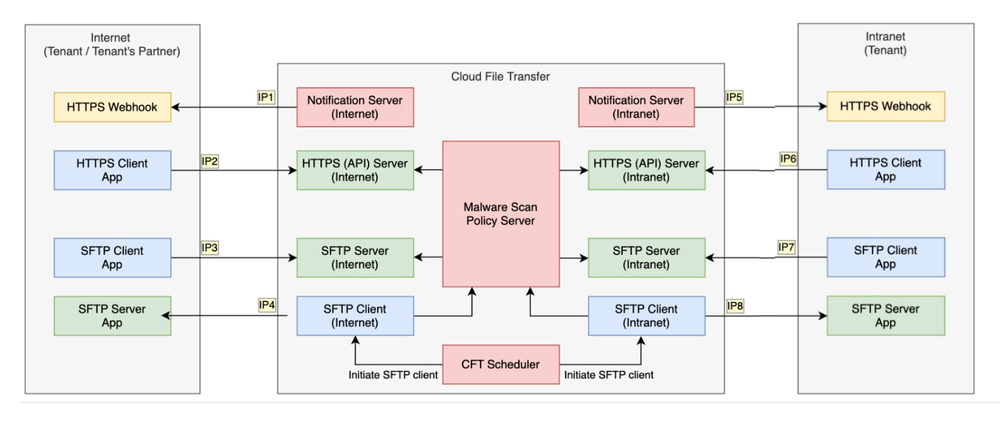

# Tenant Whitelisting Requirements

To ensure connectivity between CFT and agency systems, IP whitelisting is required in two places:
- **On CFT side:** For agencies connecting to our servers. Refer to [Whitelisting requirements](#whitelisting-requirements).
- **On agency side:** For agencies to [configure their firewalls](/firewall-clearance.md) to allow traffic from CFT IPs. 

This diagram illustrates the various connections between CFT and Tenant systems and zones.

<!-- 

<b>View a complete reference list of CFT IPs</b>

Note: This IP list corresponds to the diagram shown above.

|  | Internet | Intranet |
|-------------|----------|-----------|
| **Webhook/CFT Notification Server** | **Internet - IP1:** 18.143.30.35:443 | **Intranet - IP5:** 10.211.0.128/28:443 10.211.0.144/28:443 10.211.0.160/28:443 10.211.0.176/28:443 |
| **CFT HTTPS API Server** | **Internet - IP2:** 13.215.24.12:443 13.251.95.103:443 54.179.172.253:443 | **Intranet - IP6:** 10.211.0.128/28:443 10.211.0.144/28:443 |
| **CFT SFTP Server** | **Internet - IP3:** *SSH Only:* 18.143.254.126:22 54.255.69.2:22 13.214.73.225:22  *SSH + Password:* 13.228.88.235:22 18.142.149.152:22 52.221.109.108:22 | **Intranet -  IP7:** 10.211.0.128/26:22 |
| **CFT SFTP Client** | **Internet - IP4:** 54.255.110.113:22 | **Intranet - IP8:** 10.211.0.128/28:22 10.211.0.144/28:22 10.211.0.160/28:22 10.211.0.176/28:22 |

-->

## Whitelisting requirements

Refer to the whitelisting requirements for the CFT systems you are  connecting to.

### CFT HTTPS Server
| Zone | Required Action |
|------|----------------|
| **Internet** | No whitelisting required.  |
| **Intranet** | No whitelisting required.  If you are on GCC2.0 on AWS,  [configure static routes via GCCI Common Services Transit Gateway](/tgw/configure-routes.md).|

### CFT SFTP Server

| Zone | Required Action |
|------|----------------|
| **Internet** | Submit SR via [CFT-SM](https://go.gov.sg/cft-sm) to whitelist your agency's SFTP client |
| **Intranet** | No whitelisting required.  If you are on GCC2.0 on AWS,  [configure static routes via GCCI Common Services Transit Gateway](/tgw/configure-routes.md). |

### CFT SFTP Client

| Zone | Required Action |
|------|----------------|
| **Internet** | Submit SR via [CFT-SM](https://go.gov.sg/cft-sm) to whitelist your agency's SFTP server |
| **Intranet** | No whitelisting required |

### CFT Notification (Webhooks) Server

| Zone | Required Action |
|------|----------------|
| **Internet** | No whitelisting required. |
| **Intranet** | No whitelisting required. |

---

### CFT HTTPS Server

| Zone | Required Action |
|------|----------------|
| **Internet** | No whitelisting required.  |
| **Intranet** | No whitelisting required.  If you are on GCC2.0 on AWS,  [configure static routes via GCCI Common Services Transit Gateway](/tgw/configure-routes.md).|

### CFT SFTP Server

| Zone | Required Action |
|------|----------------|
| **Internet** | Submit SR via [CFT-SM](https://go.gov.sg/cft-sm) to whitelist your agency's SFTP client |
| **Intranet** | No whitelisting required.  If you are on GCC2.0 on AWS,  [configure static routes via GCCI Common Services Transit Gateway](/tgw/configure-routes.md). |

### CFT SFTP Client

| Zone | Required Action |
|------|----------------|
| **Internet** | Submit SR via [CFT-SM](https://go.gov.sg/cft-sm) to whitelist your agency's SFTP server |
| **Intranet** | No whitelisting required |

### CFT Notification (Webhooks) Server

| Zone | Required Action |
|------|----------------|
| **Internet** | No whitelisting required. |
| **Intranet** | No whitelisting required. |

## What's next

- You may need to allow or [whitelist CFT endpoints on your Tenant/Agency Firewalls](https://docs.developer.tech.gov.sg/docs/cft-additional-docs/firewall-clearance ).
- To validate the firewall rules **from tenant system to CFT intranet**, refer to:
    - [HTTPS Firewall Rules Testing (Intranet)](https://docs.developer.tech.gov.sg/docs/cft-additional-docs/https-firewall)
    - [SFTP Client Firewall Rules Testing (Intranet)](https://docs.developer.tech.gov.sg/docs/cft-additional-docs/sftp-firewall)

<!-- Back up 29 May 2025 

# Tenant Whitelisting Requirements

To ensure connectivity between CFT and agency systems, IP whitelisting is required in two places:
- **On CFT side:** CFT maintains an IP allowlist for agencies connecting to our SFTP services
- **On agency side:** Agencies need to configure their firewalls to allow traffic from CFT IPs. Refer to [Firewall clearance](/firewall-clearance.md).

Note: Most whitelisting requirements have been removed except for SFTP connections, which still require whitelisting on the CFT side.
 

Depending on your system and zone, perform the whitelisting steps required.

- [CFT HTTPS Server Whitelisting](#cft-https-server-whitelisting)
- [CFT SFTP Server Whitelisting](#cft-sftp-server-whitelisting)
- [CFT SFTP Client Whitelisting](#cft-sftp-client-whitelisting)
- [CFT Notification (Webhooks) Server Whitelisting](#cft-notification-webhooks-server-whitelisting)

## CFT HTTPS Server Whitelisting

| CFT Zone | Tenant Action |
|---|---|
| **Internet** | None.   CFT APIs are public and accessible within Singapore for all public IPs.
| **Intranet** | None.    If you are on GCC2.0 on AWS, follow the steps for [Configuring static routes for routing via GCCI Common Services Transit Gateway to CFT](/tgw/configure-routes.md). |

## CFT SFTP Server Whitelisting

| CFT Zone | Tenant Action |
|---|---|
| **Internet** | Raise an SR via [CFT-SM](https://go.gov.sg/cft-sm) to whitelist **your Tenant SFTP Client** on CFT.
| **Intranet** | None.    If you are on GCC2.0 on AWS, follow the steps for [Configuring static routes for routing via GCCI Common Services Transit Gateway to CFT](/tgw/configure-routes.md) |

## CFT SFTP Client Whitelisting

| CFT Zone | Tenant Action |
|---|---|
| **Internet** | Raise an SR via [CFT-SM](https://go.gov.sg/cft-sm) to whitelist **your Tenant SFTP Server** on CFT.
| **Intranet** | None.

## CFT Notification (Webhooks) Server Whitelisting

| CFT Zone | Tenant Action |
|---|---|
| **Internet** | None. Whitelisting is not required.
| **Intranet** | None.

## What's next

- To validate the firewall rules **from tenant system to CFT intranet**, refer to:
    - [HTTPS Firewall Rules Testing (Intranet)](https://docs.developer.tech.gov.sg/docs/cft-additional-docs/https-firewall)
    - [SFTP Client Firewall Rules Testing (Intranet)](https://docs.developer.tech.gov.sg/docs/cft-additional-docs/sftp-firewall)

- You may need to allow or [whitelist CFT endpoints on your Tenant/Agency Firewalls](https://docs.developer.tech.gov.sg/docs/cft-additional-docs/firewall-clearance ).

This diagram illustrates CFT Firewall configuration, depicting the various connections between CFT and Tenant systems and zones.

<b>View a complete reference list of CFT IPs</b>

Note: This IP list corresponds to the diagram shown above.

|  | Internet | Intranet |
|-------------|----------|-----------|
| **Webhook/CFT Notification Server** | **Internet - IP1:** 18.143.30.35:443 | **Intranet - IP5:** 10.211.0.128/28:443 10.211.0.144/28:443 10.211.0.160/28:443 10.211.0.176/28:443 |
| **CFT HTTPS API Server** | **Internet - IP2:** 13.215.24.12:443 13.251.95.103:443 54.179.172.253:443 | **Intranet - IP6:** 10.211.0.128/28:443 10.211.0.144/28:443 |
| **CFT SFTP Server** | **Internet - IP3:** *SSH Only:* 18.143.254.126:22 54.255.69.2:22 13.214.73.225:22  *SSH + Password:* 13.228.88.235:22 18.142.149.152:22 52.221.109.108:22 | **Intranet -  IP7:** 10.211.0.128/26:22 |
| **CFT SFTP Client** | **Internet - IP4:** 54.255.110.113:22 | **Intranet - IP8:** 10.211.0.128/28:22 10.211.0.144/28:22 10.211.0.160/28:22 10.211.0.176/28:22 |

-->

<!-- Back up 12 July 2024 : remove CLZ FW clearance

Thiru: Got the confirmation (from Sathiya - GCC team) that CLZ FW clearance  is not required anymore for GEN (GDC/GPC) to GCC2.0 or vice-versa traffic (Agency need to clear their FW if there any) , this is effective from 28th june.

## CFT HTTPS Server Whitelisting

| CFT Zone | Tenant Action |
|---|---|
| **Internet** | None. Whitelisting is not required because CFT APIs are public and accessible within Singapore for all public IPs.
| **Intranet** | If you are accessing from GPC, GDC, Agency DC (GEN network) please raise a CLZ Firewall Whitelisting request to GOVTECH AFM SR Admin in [ITSM Portal](https://gccprod.sharepoint.com/sites/GOVTECH-intranet/it/SitePages/AFM_Forms.aspx) (access using GSIB).   &nbsp;- Go to <b>Network</b> section > <b>GCC Access</b> table &nbsp;- In the entry for <b>MBC server networks to GCC</b>, download the <b>Firewall rules for Cloud Landing Zone request form</b>.  &nbsp;-  CFT HTTPS Intranet IPs (IP6):  &nbsp;&nbsp;- **10.211.0.128/28:443** &nbsp;&nbsp;- **10.211.0.144/28:443**
| | If you are on GCC1.0 or GCC2.0 on AWS, follow the steps for [Connecting to CFT VPCE](/vpc/connect.md). |

## CFT SFTP Server Whitelisting

| CFT Zone | Tenant Action |
|---|---|
| **Internet** | Raise an SR via [CFT-SM](https://go.gov.sg/cft-sm) to whitelist **your Tenant SFTP Client** on CFT.
| **Intranet** | If you are accessing from GPC, GDC, Agency DC (GEN network), please raise a CLZ Firewall Whitelisting request to GOVTECH AFM SR Admin in [ITSM Portal](https://gccprod.sharepoint.com/sites/GOVTECH-intranet/it/SitePages/AFM_Forms.aspx) (access using GSIB).   &nbsp;- Go to <b>Network</b> section > <b>GCC Access</b> table &nbsp;- In the entry for <b>MBC server networks to GCC</b>, download the <b>Firewall rules for Cloud Landing Zone request form</b>.  &nbsp;- CFT SFTP Server IP (IP7):  &nbsp;&nbsp;- **10.211.0.128/26:22**
| | If you are on GCC1.0 or GCC2.0 on AWS, follow the steps for [Connecting to CFT VPCE](/vpc/connect.md). |

## CFT SFTP Client Whitelisting

| CFT Zone | Tenant Action |
|---|---|
| **Internet** | Raise an SR via [CFT-SM](https://go.gov.sg/cft-sm) to whitelist **your Tenant SFTP Server** on CFT.
| **Intranet** | Please raise a CLZ Firewall Whitelisting request to GOVTECH AFM SR Admin in [ITSM Portal](https://gccprod.sharepoint.com/sites/GOVTECH-intranet/it/SitePages/AFM_Forms.aspx) (access using GSIB).   &nbsp;- Go to <b>Network</b> section > <b>GCC Access</b> table &nbsp;- In the entry for <b>MBC server networks to GCC</b>, download the <b>Firewall rules for Cloud Landing Zone request form</b>.  &nbsp;- CFT SFTP Client IPs (IP8):  &nbsp;&nbsp;- **10.211.0.128/28:22** &nbsp;&nbsp;- **10.211.0.144/28:22** &nbsp;&nbsp;- **10.211.0.160/28:22** &nbsp;&nbsp;- **10.211.0.176/28:22**

## CFT Notification (Webhooks) Server Whitelisting

| CFT Zone | Tenant Action |
|---|---|
| **Internet** | None. Whitelisting is not required.
| **Intranet** | Please raise a CLZ Firewall Whitelisting request to GOVTECH AFM SR Admin in [ITSM Portal](https://gccprod.sharepoint.com/sites/GOVTECH-intranet/it/SitePages/AFM_Forms.aspx) (access using GSIB).   &nbsp;- Go to <b>Network</b> section > <b>GCC Access</b> table &nbsp;- In the entry for <b>MBC server networks to GCC</b>, download the <b>Firewall rules for Cloud Landing Zone request form</b>.  &nbsp;- CFT Notification Server IPs (IP5):  &nbsp;&nbsp;- **10.211.0.128/28:443**  &nbsp;&nbsp;- **10.211.0.144/28:443** &nbsp;&nbsp;- **10.211.0.160/28:443** &nbsp;&nbsp;- **10.211.0.176/28:443** |

## What's next

- To validate the firewall rules **from tenant system to CFT intranet**, refer to:
    - [HTTPS Firewall Rules Testing (Intranet)](https://docs.developer.tech.gov.sg/docs/cft-additional-docs/https-firewall)
    - [SFTP Client Firewall Rules Testing (Intranet)](https://docs.developer.tech.gov.sg/docs/cft-additional-docs/sftp-firewall)

- You may need to allow or [whitelist CFT endpoints on your Tenant/Agency Firewalls](https://docs.developer.tech.gov.sg/docs/cft-additional-docs/firewall-clearance ).

-->

<!--  Back up 13 Jun

## CFT HTTPS Server Whitelisting

| CFT Zone | Tenant Action |
|---|---|
| **Internet** | None. Whitelisting is not required because CFT APIs are public and accessible within Singapore for all public IPs. //// DELETE However, if you want to access CFT APIs from outside of Singapore, you need to raise an SR via [CFT-SM](https://go.gov.sg/cft-sm) with your details. ////
| **Intranet** | If you are accessing from GPC, GDC, Agency DC (GEN network) or from GCC1.0, GCC2.0 on Google Cloud/Azure Cloud:   • Raise a CLZ Firewall Whitelisting request to GovTech AFM SR Admin at afm_sr_admin@tech.gov.sg and include your system details and CFT HTTPS Intranet IPs (IP6):  &nbsp;&nbsp;- **10.211.0.128/28:443** &nbsp;&nbsp;- **10.211.0.144/28:443**
| | If you are on GCC1.0 or GCC2.0 on AWS, raise an SR via [CFT-SM](https://go.gov.sg/cft-sm) for VPC Private Link setup. |

## CFT SFTP Server Whitelisting

| CFT Zone | Tenant Action |
|---|---|
| **Internet** | Raise an SR via [CFT-SM](https://go.gov.sg/cft-sm) to whitelist **your Tenant SFTP Client** on CFT.
| **Intranet** | If you are accessing from GPC, GDC, Agency DC (GEN network) or from GCC1.0, GCC2.0 on Google Cloud/Azure Cloud:   • Raise a CLZ Firewall Whitelisting request to GovTech AFM SR Admin at afm_sr_admin@tech.gov.sg and include your system details and CFT SFTP Server IP (IP7):  &nbsp;&nbsp;- **10.211.0.128/26:22**
| | If you are on GCC1.0 or GCC2.0 on AWS, raise an SR via [CFT-SM](https://go.gov.sg/cft-sm) for VPC Private Link setup. |

## CFT SFTP Client Whitelisting

| CFT Zone | Tenant Action |
|---|---|
| **Internet** | Raise an SR via [CFT-SM](https://go.gov.sg/cft-sm) to whitelist **your Tenant SFTP Server** on CFT.
| **Intranet** | Raise a CLZ Firewall Whitelisting request to GovTech AFM SR Admin at afm_sr_admin@tech.gov.sg and include your system details and CFT SFTP Client IPs (IP8):  &nbsp;&nbsp;- **10.211.0.128/28:22** &nbsp;&nbsp;- **10.211.0.144/28:22** &nbsp;&nbsp;- **10.211.0.160/28:22** &nbsp;&nbsp;- **10.211.0.176/28:22**

//// DELETE
| | If you are on GCC1.0 or GCC2.0 on AWS, raise an SR via [CFT-SM](https://go.gov.sg/cft-sm) for VPC Private Link setup. | //// DELETE

## CFT Notification (Webhooks) Server Whitelisting

| CFT Zone | Tenant Action |
|---|---|
| **Internet** | None. Whitelisting is not required.
| **Intranet** | Raise a CLZ Firewall Whitelisting request to GovTech AFM SR Admin at afm_sr_admin@tech.gov.sg and include your system details and CFT Notification Server IPs (IP5):  &nbsp;&nbsp;- **10.211.0.128/28:443**  &nbsp;&nbsp;- **10.211.0.144/28:443** &nbsp;&nbsp;- **10.211.0.160/28:443** &nbsp;&nbsp;- **10.211.0.176/28:443** |

-->

